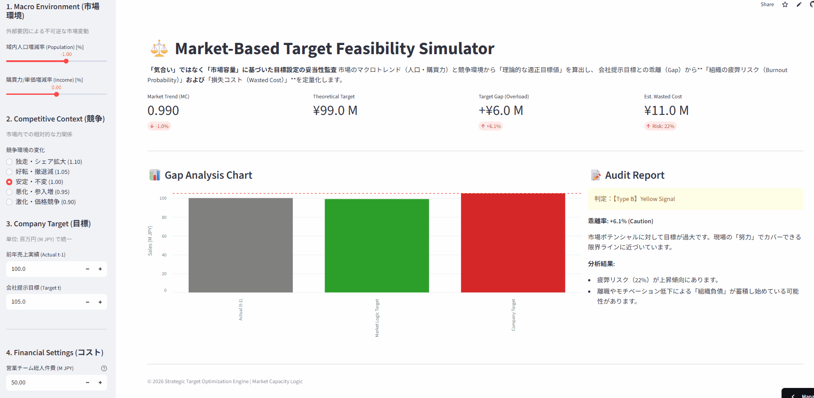

# 📉 Market-Based Target Feasibility Simulator
**「前年比目標」の妥当性を、市場マクロデータに基づいて定量監査するシミュレーター**

[](https://market-based-target-simulator-zwqtvkegecarptxsefwrrk.streamlit.app/)


<br>



---

## 📌 Executive Summary
**「市場が縮小しているのに、なぜ目標だけが増えるのか？」**

本ツールは、因習的な「前年比プラス目標（Year-Over-Year Target）」が、実際の市場容量（Market Capacity）とどれだけ乖離しているかを診断する**構造的監査ツール**です。

人口動態・購買力推移・競争環境係数から**「理論的な限界売上（Theoretical Potential）」**を算出し、会社目標とのギャップから発生する**「組織疲弊コスト（Burnout Cost）」**をリアルタイムで金額換算します。

---

## 🎯 Business Value
本モデルは、単なる売上予測ではなく、経営ガバナンスにおける以下の意思決定を支援します。

* **Prevent Burnout:** 達成不可能な目標による現場の疲弊・連鎖離職を未然に防ぐ。
* **Rationalize Budget:** 「気合い」や「過去の踏襲」ではなく、客観的な市場データに基づいた予算策定の正当性を担保する。
* **Exit Strategy:** 構造的に成長が見込めない市場（Type C判定）からの「戦略的撤退」を合理化する。

---

## 🛠 Model Logic (Market Capacity Logic)

### 1. Market Capacity Index
自社の努力に依存しない、外部環境による「器」の変化を定義します。
$$TheoreticalTarget = Actual_{t-1} \times (1 + \Delta Pop) \times (1 + \Delta Income) \times K_{comp}$$

### 2. Burnout Cost Calculation (Sigmoid Function)
組織の疲弊（Burnout）は線形ではなく、閾値を超えると非線形に加速すると仮定し、**正規化ロジスティック関数**を採用しています。
$$Ratio = \frac{1}{1 + e^{-k(Gap - Gap_{threshold})}}$$
*(k=20, Threshold=10% gap)*

乖離が10%を超えたあたりから、組織的な抵抗と生産性の低下が急激に顕在化する構造を再現しています。

---

## 📊 Outputs & Interpretation

| Output Metric | Description | Decision Making |
| :--- | :--- | :--- |
| **🚨 Target Gap** | 理論目標と会社目標の乖離率 | 目標設定の妥当性評価 |
| **💸 Est. Wasted Cost** | 乖離により浪費される推計人件費 | 投資対効果（ROI）の再検討 |
| **🧠 Burnout Risk** | 組織の限界到達確率 | 離職対策・リソース再配置 |

---

## 💻 How to Run

> ⚠️ This is a diagnostic prototype for strategic target auditing.

```bash
# 1. Clone the repository
git clone [https://github.com/keisuke-data-lab/market-based-target-simulator.git](https://github.com/keisuke-data-lab/market-based-target-simulator.git)

# 2. Install dependencies
pip install -r requirements.txt

# 3. Run the Simulator
streamlit run app.py
```

<br>

<div align="center">
  Author: <b>Keisuke Nakamura</b><br>
  Financial Modeling / Structural Audit / Strategic Planning
</div>